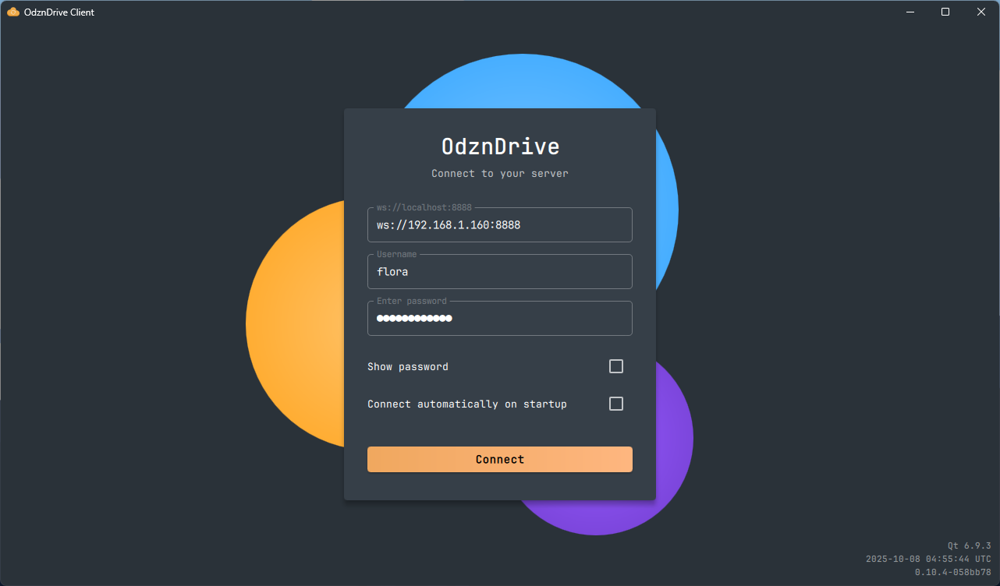
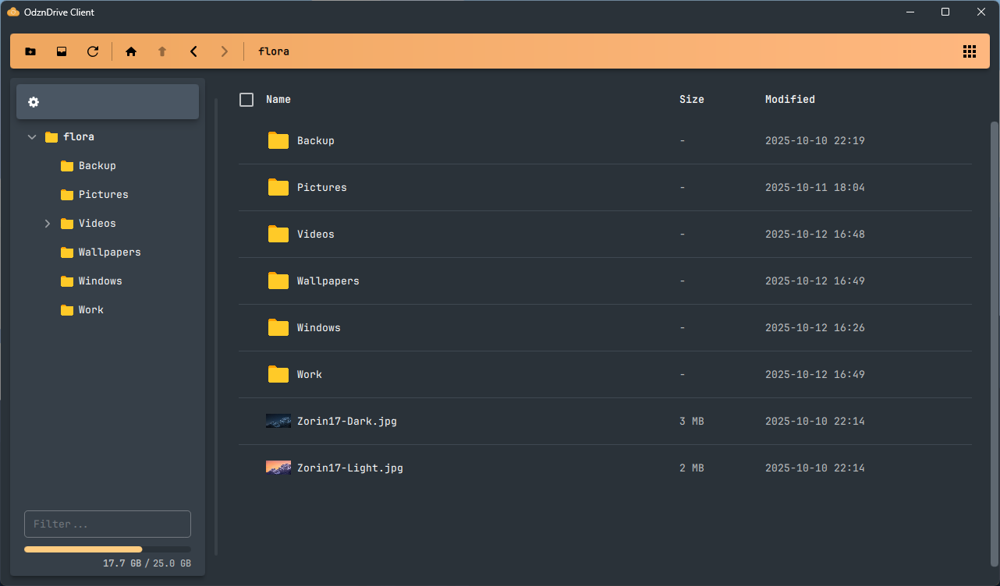

# OdznDrive

Simple client / server cloud storage solution





Client and server needs to share the same Major (**X**.x.x) and Minor(x.**X**.x) version.

Client: `0.10.2` and Server: `0.10.0` are compatible  
Client: `0.11.3` and Server: `0.10.2` are not compatible.  
Client: `0.10.1` and Server: `0.11.0` are not compatible.

- Upload single or multiple files
- Download single or multiple files
- Create shareable link for single files

Server config will be created on first run at `~/.config/Odizinne/OdznDriveServer.conf` with the following defaults:

```ini
[server]
port=8888
# default websocket port for the main application
domain=""
# domian name for file sharing (used to generate link) bypass httpUrl
httpPort=8889
# default http server port (file sharing)
httpUrl=""
# url for local file sharing (used to generate link) ignored if domain is set
shortUrl=false
# false = uuid
```

When login to server with client, if no protocol is specified in the url field, it will default to wss.

A default admin user will be created on server first run:
- Username: `admin`
- Password: `admin123`

it is STRONGLY recommended to log in with this account, create your account with a secure password (with the bottom left menu - > user managment), login to your newly created account, and delete the admin account.

